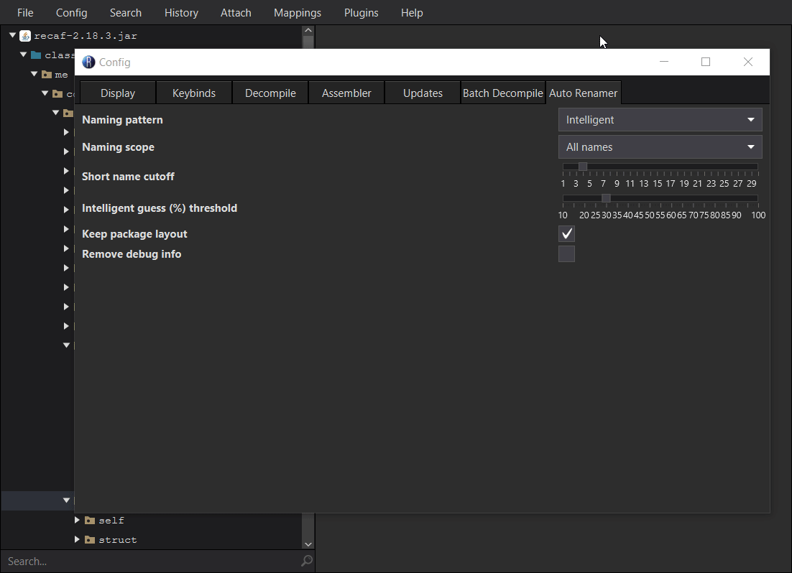

> ## NOTE: This is a plugin for Recaf 2.X
> This feature is built into later versions of Recaf 4.X

# Recaf Plugin: Auto Renamer

This plugin allows automatic renaming of classes, packages, and the entire open project at a time. It has options for filtering out what classes get named, and how to name them. By default everything will be generically named. 

## Download: [Here](https://github.com/Recaf-Plugins/Auto-Renamer/releases)

## Config

| Name                            | Description                                                  | Default Value |
| ------------------------------- | ------------------------------------------------------------ | ------------- |
| Naming pattern                  | The pattern of renaming to apply to classes that fit the scope. Options are: simple, match-source, intelligent | simple        |
| Naming scope                    | The scope of what classes/method/fields should be renamed. Options are: all, short-names, illegal-names | all           |
| Short name cut-off              | The max length of a class's name _(excluding the package)_ for it to be considered for the naming scope when set to _"Short name"_ | 3             |
| Intelligent guess (%) threshold | When the naming pattern is _"Intelligent"_ in cases where there is no parent class, it will guess what the purpose of a class is. This determines how sure the guess must be in order to use the guessed type. Since the guess percentage is split among all types, even 30% can be significant compared to the rest of the percentages. Raise this value if you want to cut down on wrongly guessed types in favor of a generic name. | 30%           |
| Keep package layout             | When a class is renamed, it will stay in the same package. If disabled it will be placed into `renamed/` | `true`        |
| Remove debug info               | In some obfuscated applications, debug info is intentionally full of trash, and decompilers can usually give variables semi-intelligent names. So removing this info can be useful. | `false`       |

**Pattern: Simple** 

- Class, field, and method names follow an incremental pattern like `Class1`, `Class2` ... and `field1`, `field2` ... etc

**Pattern: Match-source**

- Classes are named based off of what is specified in the `SourceFile` attribute.

**Pattern: Intelligent**

- Class names are based off of what the class extends or implements. If there is no parent type, the plugin will look at the types of references used in the code and give an educated guess to what the purpose of the class is. 

- Field names are based off of the defined type.
- Method names are only named when they follow simple getter/setter patterns .

**Scope: All**

- All classes/fields/methods that the pattern can generate a name for will be renamed.

**Scope: Short names**

* Only classes/field/methods with short names will be renamed.

**Scope: Illegal names**

* Only classes/fields/methods with illegal names will be renamed. This includes things like whitespaces and other unsupported unicode ranges for class names.
